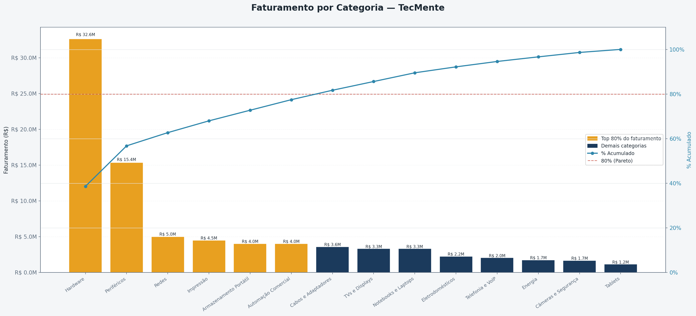
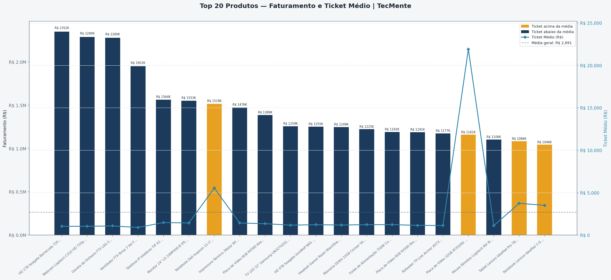

# TecMente — Pipeline de Dados para Estudo de Análise

Projeto de estudo construído do zero que simula um ambiente real de dados de um e-commerce de informática.

O pipeline cobre todas as etapas do fluxo de dados — da geração de dados sintéticos com ruído realista, passando pela extração controlada pelo DBA, tratamento pelo analista de dados, até a entrega final para consumo em BI.

O foco do projeto é reproduzir desafios reais de qualidade de dados e organização de processos encontrados em ambientes corporativos.

---

## Contexto

A **TecMente** é uma empresa fictícia de e-commerce de informática criada exclusivamente como ambiente de estudo. O objetivo é praticar SQL, Python e ferramentas de BI em um cenário realista, com dados que simulam os problemas encontrados em bases reais — CPFs com formatação inconsistente, e-mails com typo, telefones nulos, datas faltando.

---

## Tecnologias

| Camada                 | Tecnologia             |
| ---------------------- | ---------------------- |
| Banco de dados         | MySQL / MariaDB        |
| Linguagem              | Python 3.12            |
| Gerenciador de pacotes | Poetry 2.4.1           |
| Query e administração  | Azure Data Studio      |
| Manipulação de dados   | pandas                 |
| Geração de dados       | Faker                  |
| Conexão com banco      | mysql-connector-python |
| Visualização (Fase 1)  | matplotlib, seaborn    |
| Visualização (Fase 2)  | Plotly                  |
| Machine Learning       | scikit-learn            |
| Automação do fluxo     | pipeline.py (subprocess) |

---

## Estrutura do projeto

```
tecmente/
├── gerador_mestre.py             ← popula o banco completo
├── extrator.py                   ← extração semanal de dados brutos (DBA)
├── tratador.py                   ← tratamento dos dados brutos (Analista)
├── visualizador.py               ← gráficos estáticos (BI)
├── visualizador_interativo.py    ← dashboards interativos Plotly
├── previsor.py                   ← previsão de vendas (scikit-learn)
├── analise_bi.py                 ← análises avançadas de BI
├── validador_coerencia.py        ← checks de coerência das regras de negócio
├── pipeline.py                   ← orquestra todo o fluxo automaticamente
├── config.py                     ← configuração centralizada (.env via python-dotenv)
├── pyproject.toml                ← dependências do Poetry
├── .env.example                  ← modelo de credenciais (copie para .env)
├── tests/                        ← testes unitários (pytest)
├── .github/workflows/ci.yml      ← CI (ruff + pytest)
├── sql/
│   └── tecmente_schema.sql    ← schema + views analíticas (DBA executa primeiro)
├── data/
│   └── AAAA-MM-DD_tratado/       ← pasta gerada pelo tratador.py
│       ├── vendas_tratado.csv
│       ├── vendas_cancelados.csv
│       ├── produtos_estoque_tratado.csv
│       ├── clientes_tratado.csv
│       ├── equipe_lojas_tratado.csv
│       └── relatorio_qualidade.txt
└── output/
    ├── graficos/                 ← PNGs/HTML (visualizadores, previsor, BI)
    ├── relatorios/               ← HTML interativo (visualizador_interativo.py)
    ├── predicoes/                ← CSV e relatório do previsor.py
    └── analises/                 ← CSVs e relatório das análises de BI
```

> **Nota:** o `visualizador.py` encontra automaticamente a pasta `_tratado`
> mais recente dentro de `data/`. Não é necessário alterar nenhum caminho
> no código entre execuções semanais.

---

## Fluxo do pipeline

```
tecmente_schema.sql
        ↓ DBA cria o banco
gerador_mestre.py
        ↓ DBA popula com dados sintéticos
extrator.py
        ↓ DBA extrai dados brutos semanalmente → data/AAAA-MM-DD/
tratador.py
        ↓ Analista trata e entrega ao BI → data/AAAA-MM-DD_tratado/
visualizador.py
        ↓ BI gera gráficos estáticos → output/graficos/
visualizador_interativo.py
        ↓ BI gera dashboards Plotly → output/relatorios/
previsor.py (opcional)
        ↓ DS projeta vendas → output/predicoes/
analise_bi.py (opcional)
        ↓ BI gera análises avançadas → output/analises/

# Orquestração automática de todo o fluxo:
pipeline.py --prever --bi
```

---

## Separação de responsabilidades

### DBA

- Cria e mantém o schema do banco
- Popula o banco via `gerador_mestre.py`
- Executa a extração semanal via `extrator.py`
- Não realiza transformações nos dados — entrega o dado bruto

### Analista de Dados

- Recebe os CSVs brutos gerados pelo extrator
- Não tem acesso direto ao banco de produção
- Aplica limpeza, normalização, mascaramento e cálculos via `tratador.py`
- Entrega os dados tratados ao time de BI

### Time de BI

- Recebe os dados tratados e confiáveis
- Gera dashboards e relatórios via `visualizador.py`
- Não se preocupa com origem ou qualidade dos dados

---

## Banco de dados

### Tabelas

| Tabela         | Descrição                                |
| -------------- | ---------------------------------------- |
| `categoria`    | Hierarquia de categorias de produtos     |
| `fornecedor`   | 40 distribuidoras reais do setor de TI   |
| `loja`         | 6 lojas da rede (físicas e online)       |
| `departamento` | Departamentos da empresa                 |
| `produto`      | 153 produtos com descrição por template  |
| `estoque`      | Quantidade por produto por loja          |
| `funcionario`  | 80 funcionários distribuídos nas lojas   |
| `cliente`      | 10.000 clientes PF e PJ (15% PJ)         |
| `pedido`       | 100.000 pedidos com sazonalidade e canais |
| `pedido_item`  | Itens de cada pedido                     |

### Views analíticas

| View                    | Descrição                                      |
| ----------------------- | ---------------------------------------------- |
| `vw_faturamento_mensal` | Receita bruta, líquida e cancelamentos por mês |
| `vw_ranking_produtos`   | Unidades, receita e lucro bruto por produto    |
| `vw_rfm`                | Recência, Frequência e Valor por cliente       |
| `vw_vendas_canal`       | Receita e ticket médio por canal e loja        |
| `vw_categorias`         | Performance por grupo de categoria             |
| `vw_clientes`           | Clientes enriquecidos (idade, validade de e-mail, dias desde cadastro) |
| `vw_vendas_itens`       | Vendas no nível de item (produto, categoria, margem, datas) |
| `vw_pedidos` / `vw_pedidos_itens` | Pedidos e itens com join de loja/cliente/produto |

---

## Dados sintéticos — características

O `gerador_mestre.py` gera dados com **ruído realista intencional** para exercitar limpeza e qualidade de dados:

- CPF/CNPJ em 3 formatos diferentes (`123.456.789-00`, `12345678900`, `123_456_789_00`)
- ~3% de e-mails com typo no domínio (`.con` em vez de `.com`)
- ~8% de clientes sem telefone cadastrado
- ~12% de clientes sem data de nascimento
- ~4% de clientes compartilhando e-mail (compras em família)
- Sazonalidade de vendas: Black Friday (+80%), Natal (+50%), Volta às aulas (+30%)
- Distribuição de Pareto: 20% dos produtos respondem por ~60% das vendas
- Clientes segmentados: 8% super-ativos, 22% inativos, 70% normais
- Concentração geográfica: ~26% dos clientes em SP e ~12% em MG (onde ficam as lojas), com capilaridade nas demais UFs
- Sazonalidade intra-semana: dias úteis com mais vendas (segunda a sexta ~+5-8%), sábado ~-5%, domingo ~-27%
- Margem bruta **variável por faixa de preço e categoria**: LOW 45–55%, MID 38–48%, HIGH 30–40%, ULTRA 22–32%, com ajustes por grupo de categoria (ex.: Cabos e Adaptadores +4pp, Notebooks e Laptops −2pp) — o custo do item no pedido é idêntico ao custo cadastrado do produto

### Catálogo de ruído

Todas as taxas de ruído são controláveis por constantes no topo de `gerador_mestre.py` (bloco `RUIDO_*`). Ajuste-as para gerar bases mais ou menos sujas. Valores-padrão:

| Constante | Taxa | O que gera | Onde |
|---|---|---|---|
| `RUIDO_EMAIL_TYPO` | 3% | E-mail com domínio `.con` (erro de digitação) | `cliente.email` |
| `RUIDO_SEM_TELEFONE` | 8% | Telefone `NULL` (não informado) | `cliente.telefone` |
| `RUIDO_TELEFONE_VAZIO` | 2% | Telefone `""` (vazio ≠ NULL) | `cliente.telefone` |
| `RUIDO_EMAIL_FAMILIA` | 4% | E-mail familiar compartilhado (intencional) | `cliente.email` |
| `RUIDO_SEM_SOBRENOME` | 2% | Cliente sem sobrenome | `cliente.sobrenome` |
| `RUIDO_SEM_NASCIMENTO` | 12% | Sem data de nascimento | `cliente.data_nascimento` |
| `RUIDO_DESCONTINUADO` | 6% | Produto inativo (`ativo=0`) | `produto.ativo` |
| `RUIDO_CLIENTE_DUP` | 2% | Cliente com CPF/e-mail duplicado (treino de dedup) | `cliente.cpf_cnpj` |
| `RUIDO_ESPACO` | 2% | Espaços irregulares em nomes/cidades | `cliente.nome` / `cliente.cidade` |
| `RUIDO_OBS` | 5% | Observação de texto livre no pedido | `pedido.obs` |
| `RUIDO_PEDIDO_ANTES_CADASTRO` | 2% | Pedido anterior ao cadastro do cliente | `pedido.data_pedido` |

> **Datas:** pedidos ocorrem, em sua maioria, **após** o cadastro do cliente (o cadastro é datado antes do início da janela de pedidos). A taxa acima planta ~2% de pedidos anteriores ao cadastro como anomalia **controlada** para detecção — e não um viés em 100% dos registros.

---

## Regras de negócio

Regras comerciais implementadas no `gerador_mestre.py` e verificadas pelo `validador_coerencia.py`:

### Desconto por tipo de loja

- Pedidos de loja **Física**: desconto de **3%** sobre o valor bruto.
- Pedidos **Online**: desconto de **5%** sobre o valor bruto.
- O desconto é calculado **no nível do pedido** (`pedido.desconto`), nunca por item (`pedido_item` não possui coluna de desconto por linha).

### Quantidade mínima em pedidos PJ

- Pedidos de clientes **PJ** possuem no mínimo **5 produtos distintos** (uma linha por produto; a soma das unidades fica em `pedido_item.quantidade`).
- Pedidos **PF** possuem entre 1 e 4 produtos distintos.
- Definição adotada: "5 itens" = **5 produtos diferentes**, não 5 linhas nem 5 unidades.
- O gerador **não repete o mesmo produto** dentro de um mesmo pedido.

### Tipo de loja ≠ canal

| Tipo de loja | Canais possíveis                    |
| ------------ | ----------------------------------- |
| `Física`     | `Loja Física` (com atendente)       |
| `Online`     | `Site`, `Marketplace`, `WhatsApp`, `Televendas` (sem atendente) |

### Cálculo dos valores do pedido

| Campo                    | Fórmula                                   |
| ------------------------ | ----------------------------------------- |
| `valor_bruto`            | `Σ (quantidade × preco_unitario)`         |
| `pedido.desconto`        | `valor_bruto × %` (3% Física / 5% Online) |
| `pedido.valor_total`     | `valor_bruto − desconto` (valor **final**) |
| `pedido_item.preco_unitario` | Preço de **tabela** (`produto.preco_venda`), sem desconto embutido |

> **Nota:** `pedido.valor_total` armazena o **valor final** (após o desconto). Para reconstruir o valor bruto: `valor_total + desconto`. Nas views analíticas, `vw_faturamento_mensal.receita_bruta` já soma esse desconto (`SUM(valor_total + desconto)`).

---

## Instalação

```bash
# 1. Clone o repositório
git clone https://github.com/edsondeveza/tecmente.git

cd tecmente

# 2. Instale as dependências
poetry install

# 3. Crie o banco de dados
# Execute tecmente_schema.sql no Azure Data Studio ou HeidiSQL

# 4. Configure as credenciais do banco
# Copie o .env.example para .env e preencha os valores
# (config.py centraliza a leitura via python-dotenv)
cp .env.example .env
```

---

## Uso

```bash
# Popula o banco completo
poetry run python gerador_mestre.py

# Extração semanal (todo o histórico)
poetry run python extrator.py

# Extração dos últimos 7 dias (teste)
poetry run python extrator.py --dias 7

# Tratamento dos dados de hoje
poetry run python tratador.py

# Tratamento de uma data específica
poetry run python tratador.py --data 2026-03-17

# Geração dos dashboards estáticos
poetry run python visualizador.py

# Geração dos dashboards interativos (Plotly)
poetry run python visualizador_interativo.py

# Previsão de vendas (Random Forest — 14 dias)
poetry run python previsor.py

# Análises avançadas de BI (coorte, LTV, RFM, cesta, ABC/XYZ, estoque, cancelamento)
poetry run python analise_bi.py

# Apenas uma análise específica
poetry run python analise_bi.py --apenas rfm

# Pipeline completo de ponta a ponta (com previsão e análises de BI)
poetry run python pipeline.py --prever --bi

# Tudo, limitando a extração aos últimos 7 dias
poetry run python pipeline.py --dias 7 --prever --bi
```

---

## Scripts

### `gerador_mestre.py`

Popula todas as tabelas do banco sem dependência de arquivo externo. Produtos, categorias, fornecedores, clientes, funcionários e pedidos são gerados internamente com templates por categoria.

**Versão 1.1:** margens variáveis por faixa/categoria (custo do pedido = custo do produto), sazonalidade intra-semana e concentração geográfica dos clientes — ver seção "Dados sintéticos — características". Cada execução produz dados diferentes (sem seed fixo).

**Status v1.0:** `DB_CONFIG['database']` corrigido para `'tecmente'`. ✅

### `extrator.py`

Responsabilidade exclusiva do DBA. Conecta ao banco, executa as queries e grava os CSVs exatamente como os dados estão armazenados — sem transformações, cálculos ou mascaramento.

Tratamento de erros por tipo dentro da função `_executar_e_gravar`:

- `mysql.connector.Error` — erros de banco (query inválida, timeout, conexão perdida)
- `OSError` — erros de arquivo (disco cheio, sem permissão de escrita)
- `logger.exception()` no `main()` — grava o traceback completo no log automaticamente

Códigos de saída documentados:

- `0` → sucesso
- `1` → execução com erros em uma ou mais etapas
- `2` → falha na conexão com o banco

### `tratador.py`

Responsabilidade do analista de dados. Recebe os CSVs brutos e aplica:

- Conversão de tipos (`str` → `datetime`, `str` → `float`)
- Normalização de CPF/CNPJ para formato numérico único
- Correção de e-mails com typo (`.con` → `.com`)
- Mascaramento de dados sensíveis (CPF, CNPJ, e-mail)
- Cálculos de negócio (subtotal, lucro bruto, margem %)
- Extração de componentes de data (ano, mês, trimestre, dia da semana)
- Classificação por faixa de preço e faixa salarial
- Separação de pedidos cancelados em arquivo próprio
- Relatório de qualidade (`relatorio_qualidade.txt`)

Tratamento de erros por tipo no `main()`:

- `pd.errors.EmptyDataError` — CSV vazio
- `pd.errors.ParserError` — CSV corrompido ou mal formatado
- `KeyError` — coluna esperada não encontrada (ex: DBA alterou nome de coluna)
- `OSError` — erro de leitura/gravação de arquivo
- `Exception` — rede de segurança para erros não previstos

**Status v1.0:** Pré-requisitos na docstring corrigidos. ✅

### `visualizador.py`

Responsabilidade do time de BI. Lê os CSVs tratados (ou consulta as views do banco via chaveamento `FONTE = "csv" | "sql"`) e gera os dashboards em PNG.

O caminho dos dados é resolvido automaticamente — sempre aponta para a pasta `_tratado` mais recente em `data/`, sem necessidade de alterar o código entre execuções semanais.

Dashboards gerados (Fase 1 — Matplotlib/Seaborn):

| Arquivo                             | Descrição                                         |
| ----------------------------------- | ------------------------------------------------- |
| `d01_faturamento_por_loja.png`      | % de participação e valor absoluto por loja       |
| `d02_total_por_unidade.png`         | Faturamento, pedidos e ticket médio por unidade   |
| `d03_top_vendedores.png`            | Top 5 vendedores por loja em faturamento          |
| `d04_faturamento_mensal.png`        | Série temporal com bruto, líquido e cancelamentos |
| `d05_faturamento_por_categoria.png` | Faturamento por categoria com curva de Pareto     |
| `d06_produtos_ticket_medio.png`     | Top 20 produtos por receita e ticket médio        |
| `d07_rfm_scatter.png`               | Dispersão RFM — Recência × Frequência × Valor     |
| `d07_rfm_heatmap.png`               | Heatmap RFM — valor total por segmento R × F      |

**Status v2.0:** Todos os 7 dashboards implementados e validados. ✅

### `visualizador_interativo.py`

Versão interativa (Plotly) do mesmo conjunto de dashboards, gerando **HTML** que abre no navegador (`output/relatorios/*.html`). Usa os mesmos dados tratados/views, com tooltips, filtros e responsividade.

Dashboards gerados (Fase 2 — Plotly):

| Arquivo                                        | Descrição                                       |
| ---------------------------------------------- | ----------------------------------------------- |
| `d01_faturamento_por_loja.html`                | Participação % + valor absoluto por loja        |
| `d02_total_por_unidade.html`                   | Faturamento, pedidos e ticket médio por unidade |
| `d03_top_vendedores.html`                      | Top vendedores por loja                         |
| `d04_faturamento_mensal.html`                  | Bruto, líquido e cancelamentos por mês          |
| `d05_faturamento_por_categoria.html`           | Faturamento por categoria + Pareto              |
| `d06_produtos_ticket_medio.html`               | Top produtos por receita e ticket médio         |
| `d07_rfm_scatter.html` / `d07_rfm_heatmap.html` | Análise RFM de clientes                         |

**Status v1.0:** Tipagens do Pylance reforçadas (casts + `reset_index()`), dashboards validados. ✅

### `previsor.py`

Previsão de vendas com **Random Forest** (scikit-learn). Agrega a receita diária, constrói features de calendário (dia da semana, mês, semana do ano) e defasagens (lag 1/7/14), treina o modelo e projeta **14 dias** à frente de forma recursiva.

Saídas em `output/predicoes/`: CSV com a previsão (`previsao_vendas.csv`), relatório (`relatorio_previsao.txt`) e gráfico HTML (`previsao_vendas.html`).

**Status v1.0:** Treino/teste com métricas MAE, RMSE e MAPE; funções testadas isoladamente. ✅

### `analise_bi.py`

Módulo de análises avançadas de BI (papel: Analista de BI Sênior) que lê os dados tratados e gera insights em `output/analises/`:

| Análise              | Arquivos                                          | O que entrega |
| -------------------- | ------------------------------------------------- | ------------- |
| Retenção por coorte  | `coorte_retencao.csv`, `bi_coorte_retencao.html`  | Matriz de retenção % por mês de aquisição |
| LTV por segmento     | `ltv_segmentos.csv`                               | LTV, ticket médio e pedidos por tipo × canal |
| RFM rotulado         | `rfm_clientes.csv`, `rfm_resumo.csv`, `bi_rfm_scatter.html` | Segmentação com rótulos (Campeões, Fiéis, Em Risco...) |
| Afinidade de cesta   | `afinidade_cesta.csv`                             | Produtos comprados juntos (co-ocorrências) |
| ABC/XYZ de produtos  | `abc_xyz_produtos.csv`, `bi_abc_xyz.html`         | Priorização A/B/C (receita) × X/Y/Z (estabilidade) |
| Saúde de estoque     | `saude_estoque.csv`                               | Cobertura em dias, alertas de ruptura/excesso |
| Cancelamento por canal | `cancelamento_canal.csv`, `bi_cancelamento_canal.html` | Taxa e receita perdida por canal |

Um relatório consolidado (`relatorio_analises.txt`) resume os principais achados. A análise respeita o valor real do pedido mesmo quando o CSV repete `valor_total` por item — via agregação no nível de pedido antes das somas.

**Status v1.0:** 8 análises implementadas e testadas (11 testes unitários). ✅

### `pipeline.py`

Orquestra todas as etapas via `subprocess` em sequência: extração → tratamento → dashboards estáticos → dashboards interativos → (opcional) previsão → (opcional) análises de BI. Interrompe e reporta falha caso uma etapa retorne código de saída ≠ 0.

**Agendamento** (Task Scheduler do Windows):

```bat
schtasks /create /tn "TecMente_Pipeline" /tr "C:\estudos\tecmente\.venv\Scripts\python.exe C:\estudos\tecmente\pipeline.py --prever --bi" /sc daily /st 06:00
```

**Status v1.1:** Execução de ponta a ponta validada (extração → análises de BI), com flags `--prever` e `--bi`. ✅

---

## Exemplos visuais

### 📊 Faturamento por Categoria (Pareto)

Análise baseada no princípio de Pareto, destacando as categorias responsáveis por maior parte da receita.



---

### 📈 Top Produtos — Faturamento e Ticket Médio

Comparação entre faturamento total e ticket médio por produto, destacando itens acima e abaixo da média.



## 📊 Insights dos Dashboards

### 🟠 Faturamento por Loja

- O faturamento está **bem distribuído entre as lojas**, sem grande concentração em uma única unidade.
- A variação entre a loja com maior e menor faturamento é relativamente pequena, indicando **equilíbrio operacional**.
- A Loja Paulista apresenta o maior faturamento, mas com diferença pouco significativa em relação às demais.
- O Escritório Central possui o menor faturamento, o que pode indicar seu papel mais logístico/comercial do que operacional.
- Esse cenário sugere uma operação madura, com boa distribuição de vendas e menor risco de dependência de uma única unidade.

---

### 🟡 Total por Unidade

- Diferença relevante entre unidades sugere assimetria na distribuição de vendas.
- Possível desalinhamento entre estoque e demanda em determinadas regiões.
- Rebalanceamento logístico pode aumentar eficiência e reduzir ruptura.

---

### 🟢 Top Vendedores

- Pequeno grupo de vendedores concentra grande parte do faturamento.
- Indício de alta performance individual, mas baixa padronização do time.
- Oportunidade de criar playbook comercial baseado nos top performers.

---

### 🔵 Faturamento Mensal

- Presença de sazonalidade nas vendas, indicando períodos de maior e menor demanda.
- Possibilidade de campanhas estratégicas em meses de baixa performance.
- Crescimento consistente pode indicar maturidade operacional ou expansão da base de clientes.

---

### 🟣 Faturamento por Categoria (Pareto)

- Aplicação do princípio de Pareto: poucas categorias concentram a maior parte do faturamento.
- Categorias como Hardware e Periféricos dominam a receita.
- Estratégias recomendadas:
  - Priorizar estoque e disponibilidade dessas categorias
  - Criar campanhas de upsell e cross-sell
- Categorias de baixo desempenho podem ser revistas ou reposicionadas.

---

### 🟤 Produtos por Ticket Médio

- Produtos com alto faturamento nem sempre possuem alto ticket médio.
- Identificação de produtos premium vs produtos de volume.
- Estratégias possíveis:
  - Aumentar ticket médio com combos e kits
  - Incentivar venda de produtos de maior valor agregado
- Produtos acima da média representam oportunidades de maior margem.

---

### ⚫ RFM (Recência, Frequência e Valor)

- Segmentação de clientes baseada em comportamento de compra.
- Permite identificar:
  - Clientes fiéis (Campeões/Fiéis concentram a maior parte do faturamento)
  - Clientes em risco
  - Clientes de alto valor
- Base para campanhas personalizadas e estratégias de retenção.
- Implementado no `analise_bi.py` (com rótulos e heatmaps). ✅

---

## 💡 Resumo Executivo

A análise evidencia concentração de receita em categorias, produtos e vendedores específicos, reforçando a importância de estratégias focadas em Pareto, otimização comercial e gestão de mix de produtos para maximizar resultados.

## Padrões adotados

- **PEP 8** — estilo de código (snake_case, 79 caracteres, imports organizados)
- **PEP 257** — docstrings com `Args:`, `Returns:` e `Raises:`
- **PEP 484** — type hints em todas as funções

---

## Status do pipeline

| Etapa               | Script                          | Status          | Validado em |
| ------------------- | ------------------------------- | --------------- | ----------- |
| Schema do banco     | `tecmente_schema.sql`           | ✅ Concluído     | 2026-04-13  |
| Geração de dados    | `gerador_mestre.py`             | ✅ Concluído     | 2026-09-18  |
| Extração DBA        | `extrator.py`                   | ✅ Concluído     | 2026-04-13 |
| Tratamento Analista | `tratador.py`                   | ✅ Concluído     | 2026-04-13 |
| Entrega ao BI       | `visualizador.py`               | ✅ Concluído     | 2026-04-13 |
| Dashboards Plotly   | `visualizador_interativo.py`    | ✅ Concluído     | 2026-09-14 |
| Previsão ML         | `previsor.py`                   | ✅ Concluído     | 2026-09-14 |
| Automação do fluxo  | `pipeline.py`                   | ✅ Concluído     | 2026-09-18 |
| Análises de BI      | `analise_bi.py`                 | ✅ Concluído     | 2026-09-18 |

---

## Próximos passos

### Evoluções planejadas

- [x] Entrega ao BI — Python (matplotlib / seaborn)
- [x] Visualizações estáticas — 7 dashboards em PNG
- [x] Visualizações interativas — Plotly (7 dashboards HTML)
- [x] Análise preditiva de vendas — Random Forest (14 dias)
- [x] Automatização do fluxo — `pipeline.py` + agendamento (Task Scheduler / cron)
- [x] Análises avançadas de BI — `analise_bi.py` (coorte, LTV, RFM, cesta, ABC/XYZ, estoque, cancelamento)
- [ ] Power BI — após conclusão da formação Daxus
- [x] CI — GitHub Actions (ruff + pytest) via workflow em `.github/`

---

## Observações

Este projeto foi desenvolvido com fins exclusivamente educacionais. Todos os dados são sintéticos e gerados automaticamente — nenhum dado real de pessoas ou empresas foi utilizado. Os CNPJs dos fornecedores são fictícios gerados pela biblioteca Faker.
